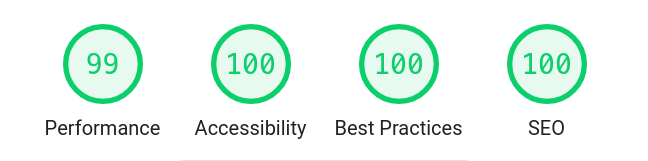

<!-- AUTO-GENERATED-CONTENT:START (STARTER) -->
<p align="center">
  <a href="https://gluginfinite.github.io">
    
  </a>
</p>
<h1 align="center" style="margin-top: 10px">
  Glug Infinite
</h1>

## FOSS ([Free & Open-Source Software](https://en.wikipedia.org/wiki/Free_and_open-source_software))

Free and open-source software's are software's that can be classified as both Free software and Open-source software. That is, anyone is freely licensed to use, copy, study, and change the software in any way, and the source code is openly shared so that people are encouraged to voluntarily improve the design of the software. This is in contrast to proprietary software, where the software is under restrictive copyright licensing and the source code is usually hidden from the users.

[](http://www.youtube.com/watch?v=MtNcxMuphLc "FOSS")

## Adding your profile :boy: :girl:

Submit a pull request by adding your profile to the `src/data/members` directory.

- Create a new file with your github username and .md as extenstion. eg: `criston.md`
- In the file add the following lines by filling out the details.

```
---
username: YOUR_GITHUB_USERNAME
name: YOUR_FULL_NAME
designation: YOUR_DESIGNATION_IN_SOSC
email: YOUR_EMAIL_ADDRESS
linkedin: YOUR_LINKEDIN_PROFILE_URL (optional)
skills: YOUR_SKILLS (separated by comma)
---
```

eg:

```
---
username: criston
name: Criston Mascarenhas
designation: Community Lead
email: example@gmail.com
linkedin: https://www.linkedin.com/in/criscodes/
skills:Design, web, Public speaking
---
```

## Creating a new Blog Post :memo:

To submit a new Blog post, create a new folder in the `src/data/blog` directory.  
Name the folder with date of posting and slug eg: `2018-08-02--First-blog-post`.  
Add the images you want to include in yor blog inside this directory and create a markdown file with the name `index.md`.
Add the following frontmatter details into the markdown file followed by your blog post in markdown format.
And finally submit a Pull Request.

PS:

- Path is where your blog post will be available on the website and the prefix `/blog/` is required to identify it as a blog.
- Description should be written in a single line, with considerably almost 2-3 lines as viewable. Make it short and descriptive.
- Date should be in the format YYYY-mm-dd
- Your author name should be your github profile url.

```
---
path: /blog/YOUR-BLOG-POST-URL (add your post title with hyphens instead of spaces, in Lowercase only)
date: 2018-08-02
author: crstnmac
name: Criston Mascarenhas
title: Second blog post
tags: blog post
cover: './cover.jpg'
description: 'Lorem ipsum dolor sit amet, consectetur adipiscing elit, sed do eiusmod tempor incididunt ut labore et dolore magna aliqua. Ut enim ad minim veniam, quis nostrud exercitation ullamco laboris nisi ut aliquip ex ea commodo consequat. Duis aute irure'
---

# Your blog post in Markdown
```

## Creating a new Event :triangular_flag_on_post:

To submit a new event details, create a folder in the `src/data/events/` directory with the name of the event.  
Create a new Markdown file with the name `index.md` and add any images if you want to refer in the same directory.  
Follow the below format with all the details inside the markdown file and submit a Pull Request to this repository.

PS:

- Slug is where your blog post will be available on the website and the prefix `/data/` is a must to identify it as an event.
- Date should be in the format YYYY-mm-dd

eg.

```
---
path: /events/gitit20
name: gitit:20
date: 2018-12-02
location: Seminar Hall
cover: './cover.png'
link: REGISTRATION_LINK (leave empty if not needed)
feedback_link: LINK_TO_SUBMIT_THE_FEEDBACK (leave empty if not needed)
---

```

## Contribution

Contributions to this project shall be done using Pull Requests(PR) only!, so the users must fork and clone this project to their local machines and once the user update the contents of the project send in a PR to this repository which will be verified and merged by the team leads.

## Newbies head over Here 👉<a href="https://viz38.github.io/First-Pull-Request/" target="_blank">CLICK!!</a>

## ❗ Code of Conduct

Glug-Infinite is dedicated to building a welcoming, diverse, safe community. We expect everyone participating in this community to abide by our [**Code of Conduct**](https://gist.github.com/cristonkrizz/8c7a493530ca799feb83487a5bd234f9). Please read it. Please follow it. In this community, we work hard to build each other up and create amazing things together. 💪💜

### 🚀 Website performance



## 🎓 Learning Gatsby

Looking for more guidance? Full documentation for Gatsby lives [on the website](https://www.gatsbyjs.org/). Here are some places to start:

- **For most developers, we recommend starting with our [in-depth tutorial for creating a site with Gatsby](https://www.gatsbyjs.org/tutorial/).** It starts with zero assumptions about your level of ability and walks through every step of the process.

- **To dive straight into code samples, head [to our documentation](https://www.gatsbyjs.org/docs/).** In particular, check out the _Guides_, _API Reference_, and _Advanced Tutorials_ sections in the sidebar.

<!-- AUTO-GENERATED-CONTENT:END -->

```

```
